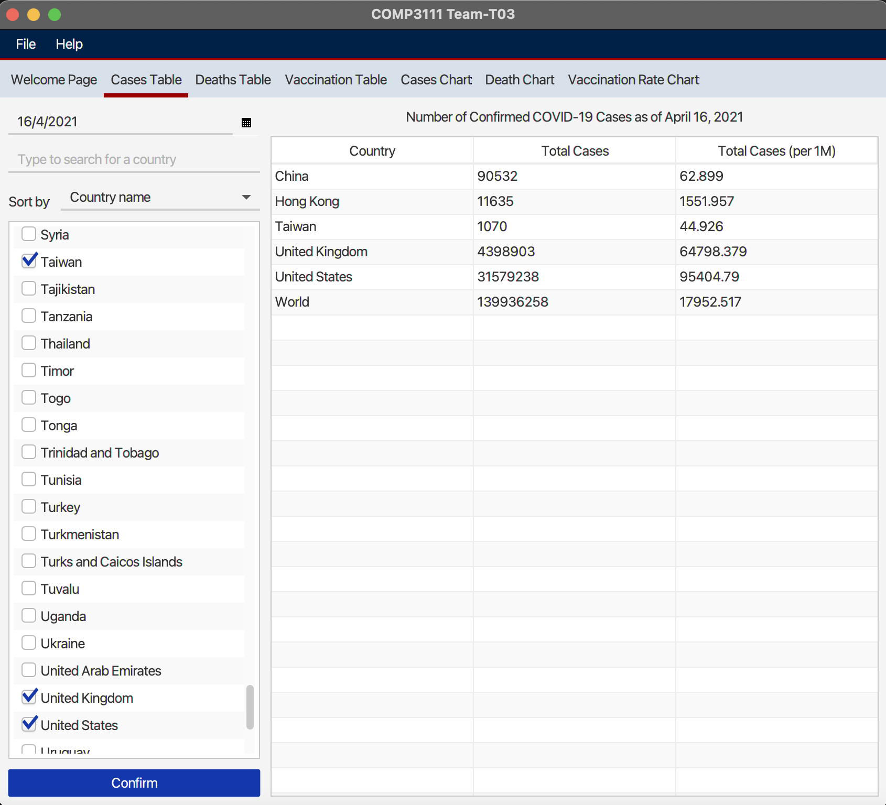
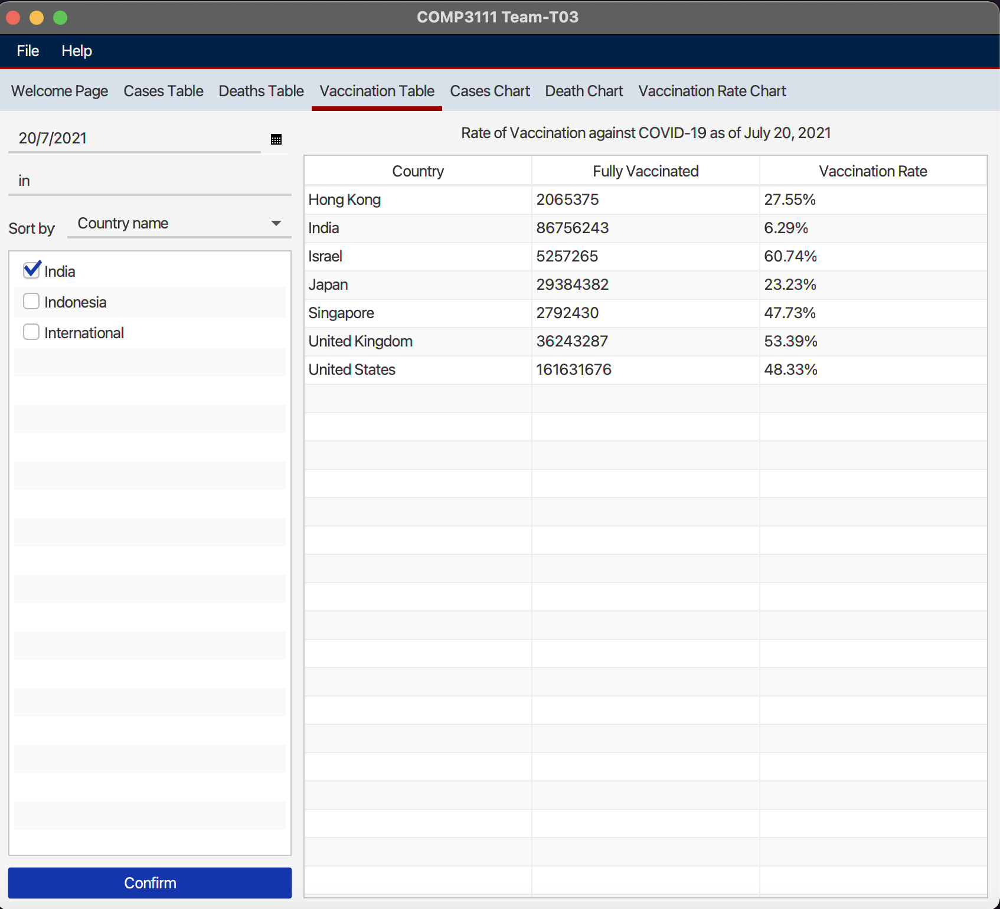
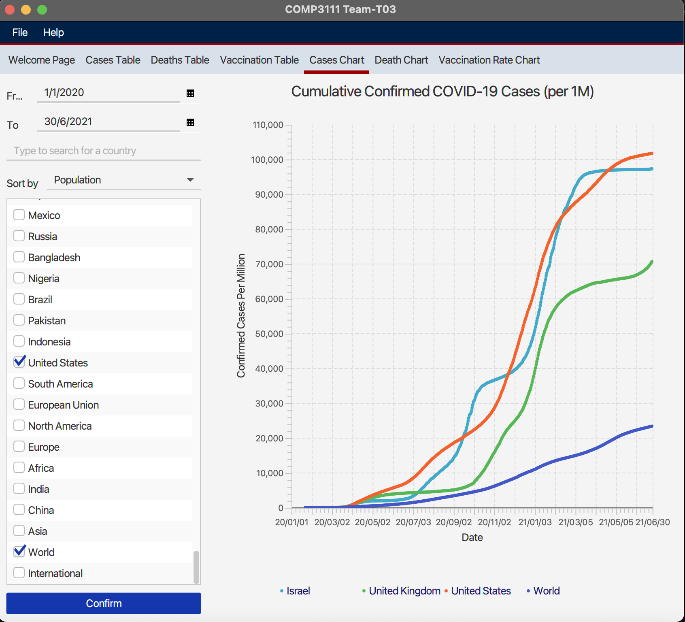
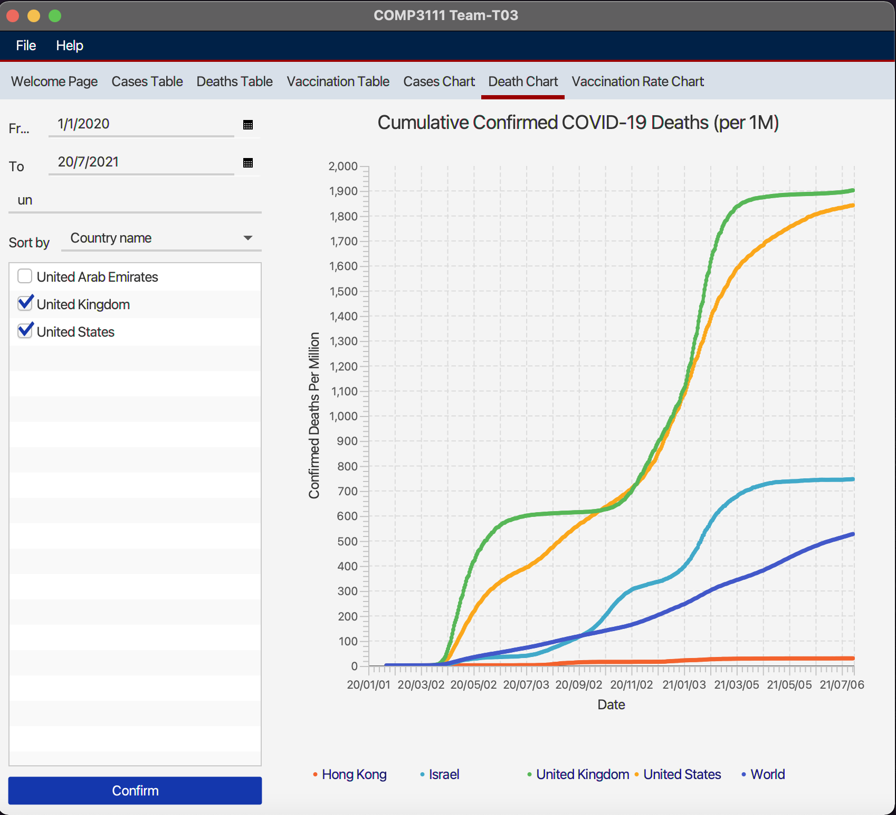
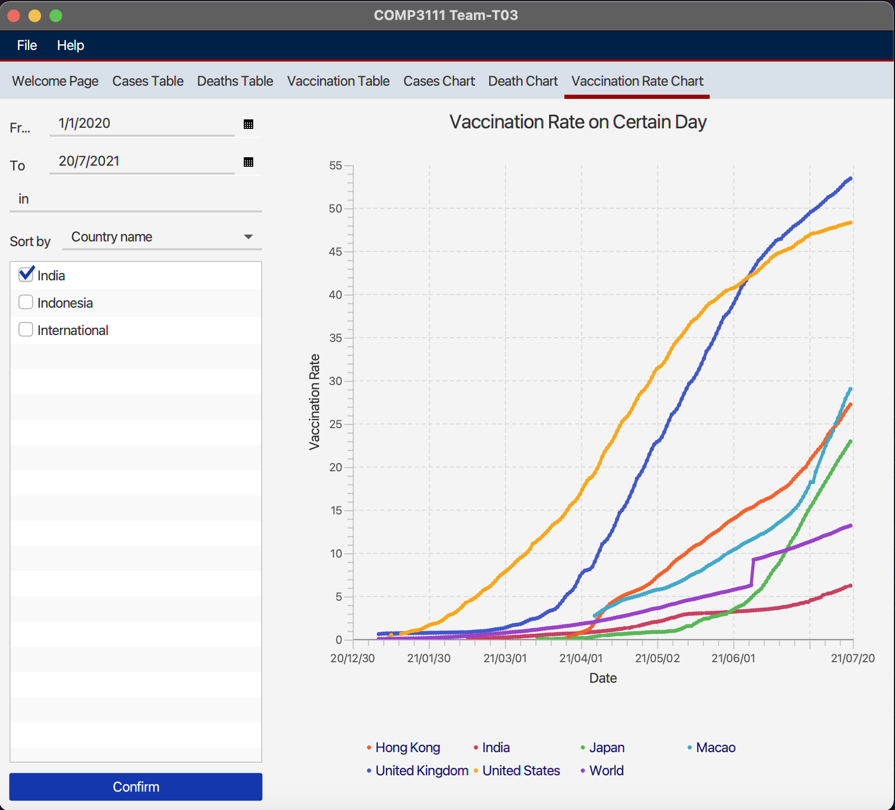
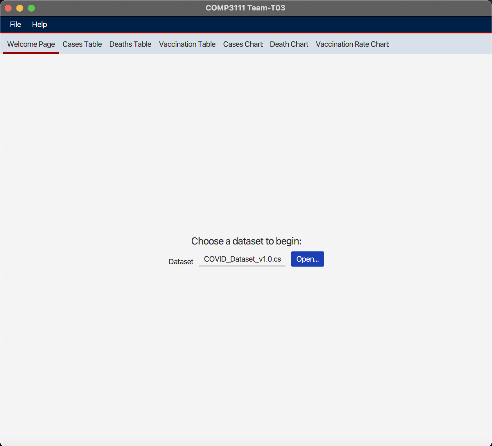
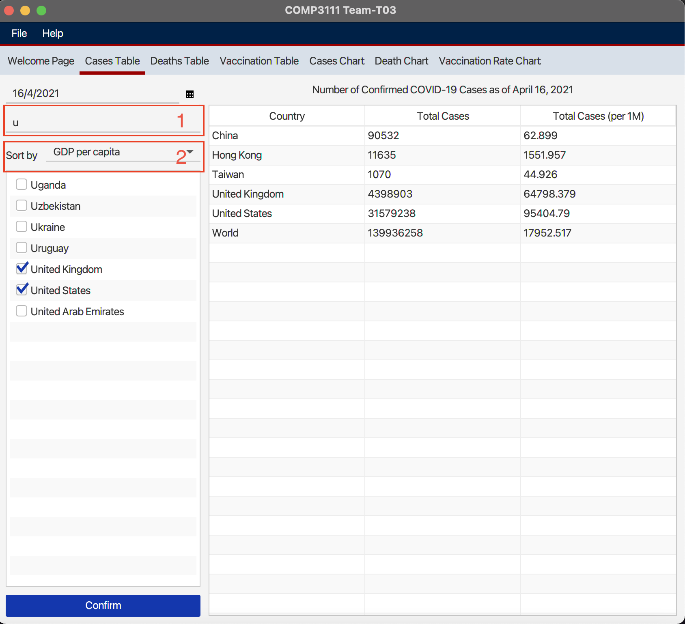
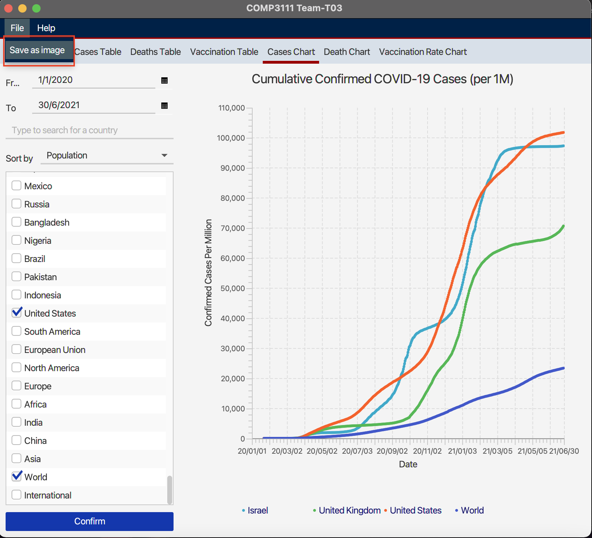
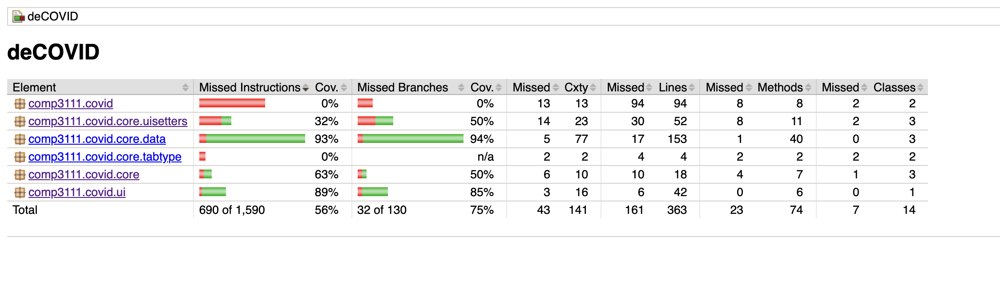
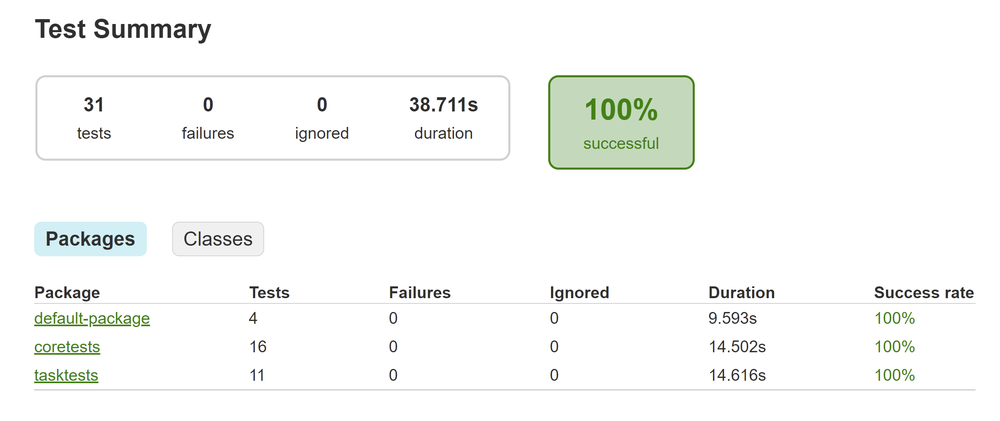

# covid19-case-data-vis

## Members’ Personal Particulars

### 1. YU Yue (Bruce)
> email: yyubv@connect.ust.hk \
> github: [Bruceshark](https://github.com/Bruceshark)  
> task: Task A \
> branch: [yyubv](https://github.com/Bruceshark/comp3111_proj_T03/tree/yyubv)

### 2. CHEN Yipu
> email: ycheniu@connect.ust.hk \
> github: [YC](https://github.com/peterchenyipu)  
> task: Task B \
> branch: [ycheniu](https://github.com/Bruceshark/comp3111_proj_T03/tree/ycheniu)

### 3. XU Mingshi
> email: mxuax@connect.ust.hk \
> github: [XU Mingshi](https://github.com/mxuax)  
> task: Task C \
> branch: [xms](https://github.com/Bruceshark/comp3111_proj_T03/tree/mxuax)

## Application Demo
### Table-Generating Task
#### Task A

#### Task B

#### Task C

### Chart-Generating Task
#### Task A

#### Task B

#### Task C

### Extra Features (Supplementary)
#### DIY dataset import 
Users can import their own datasets downloaded from https://ourworldindata.org/.

#### Search & Sort
In every table/chart generating task, users can search the desired countries (shown in box 1), and sort by the attributes of countries (shown in box 2).

#### Chart export
In chart generating tasks, users can save the generated chart as an image file to the local disk.

## Testing Reports
#### [Jacoco Report](source_code_material/jacocoHTML/index.html)

#### [JUnit](source_code_material/junit/index.html)

## Java Doc
#### [Java Doc](source_code_material/javadoc/index.html)
